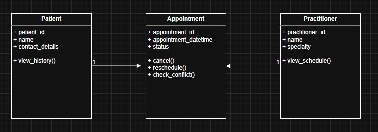

# Requirement-to-Concept Trace
|                            Requirement                            |      Concept       |             State/behaviour              |          Decision           |
| :---------------------------------------------------------------: | :----------------: | :--------------------------------------: | :-------------------------: |
|  FR-01 Create a new patient record with name and contact details  |      Patient       | State: patient_id, name, contact_details |       Accept as class       |
|                FR-02 Search for a patient by name                 |      Patient       |   Behaviour: search() or find patient    |   Supports Patient class    |
|   FR-03 Create new practitioner record with name and specialty    |    Practitioner    | State: practitioner_id, name, specialty  |       Accept as class       |
| FR-04 Book appointment for patient with practitioner at date/time |    Appointment     |     State: appointment_id, date_time     |       Accept as class       |
|              FR-05 Prevent conflicting appointments               |    Appointment     |       Behaviour: validate conflict       |        Add behaviour        |
|              FR-06 View appointments for a given day              |    Appointment     |     Behaviour: retrieve appointments     | Supports Appointment class  |
|                     Track appointment status                      | Appointment Status |              State: status               |    Attribute, not class     |
|                  Per-patient appointment history                  |    Appointment     |        Behaviour: access history         |    Supports relationship    |
|                 Practitioner's own schedule view                  |    Practitioner    |        Behaviour: view_schedule()        | Supports Practitioner class |

# CRC Cards
### Patient
|     Responsibilities     | Collaborators |
| :----------------------: | :-----------: |
|  Store patient details   |  Appointment  |
| View appointment history | Practitioner  |

### Practitioner
|      Responsibilities      | Collaborators |
| :------------------------: | :-----------: |
| Store practitioner details |  Appointmnt   |
| View appointment schedule  |    Patient    |

### Appointment
|         Responsibilities         | Collaborators |
| :------------------------------: | :-----------: |
| Record appointment date and time |    Patient    |
|     Track appointment status     | Practitioner  |

### Optional Class
|      Responsibilities       | Collaborators |
| :-------------------------: | :-----------: |
| Maintain clinic information | Practitioner  |
| Manage clinic appointments  |  Appointment  |

# UML Class Diagram

# Design Rationale
Clinic was included as an optional class because it represents the organisation in which patients, practitioners, and appointments exist. However, the core domain model remains focused on Patient, Practitioner, and Appointment because these concepts are directly supported by the requirements

The SmartCare domain model was developed from the confirmed system requirements. Three core classes were selected: Patient, Practitioner, and Appointment because they represent the main business entities described in the requirements. The system must create and search patient records, create practitioner records, and manage appointments, making these classes essential to the domain model.

Responsibilities were assigned using CRC card analysis. The Patient class is responsible for storing patient information and maintaining appointment history. The Practitioner class is responsible for storing practitioner details and supporting schedule management. The Appointment class records booking information, appointment date and time, appointment status, and supports actions such as cancellation and rescheduling.

An association relationship was chosen between Patient and Appointment because a patient can have multiple appointments over time, while each appointment belongs to one patient. A similar one-to-many association was chosen between Practitioner and Appointment because a practitioner can have many appointments, but each appointment is assigned to one practitioner. These relationships support appointment booking, appointment history, and schedule management requirements.

Inheritance was not used because none of the identified classes have an "is-a" relationship. For example, an Appointment is not a type of Patient or Practitioner. Association relationships better represent the interactions between the domain concepts.

An optional Clinic class was considered because it represents the organisation in which patients, practitioners, and appointments exist. However, the core domain model remains focused on Patient, Practitioner, and Appointment because these concepts are directly supported by the confirmed requirements. The Clinic class was therefore treated as a supporting concept rather than a central domain entity.

# AI Design Review Record
| AI Suggestion | Evidence | Decision | Reason | Model Change |
| :-----------: | :------: | :------: | :----: | :----------: |
| Patient class | FR-01 and FR-02 require creating and searching patient records. | Accepted | Directly supported by confirmed requirements. | Added Patient class to UML. |
| Clinic class | Clinic is mentioned in the business context, but no functional requirement defines clinic behaviour. | Modified | Useful as an optional concept but not a core domain class. | Added as optional class only. |
| PatientManager | No requirement refers to a manager class. | Rejected | Represents implementation logic rather than a business entity. | No change to model. |
| Appointment class | FR-04 and appointment management requirements require appointments to be stored and managed. | Accepted | Core domain entity. | Added Appointment class and relationships. |
| NotificationManager | Automated reminders are listed as provisional and require confirmation. | Rejected | Not part of the confirmed requirements. | No change to model. |