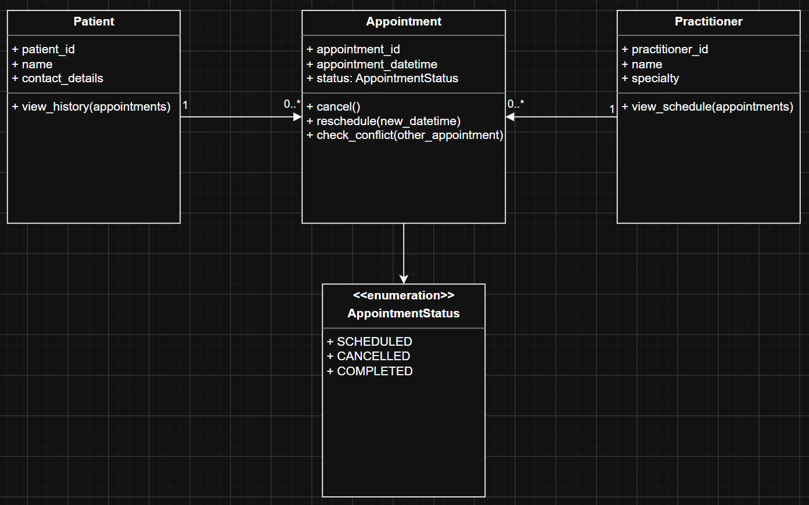

# UML-to-Code Trace

|               UML Element               |                         Python Element                          | Implemented? |                                  Notes                                   |
| :-------------------------------------: | :-------------------------------------------------------------: | :----------: | :----------------------------------------------------------------------: |
|                 Patient                 |                         `class Patient`                         |     Yes      |                         Domain class implemented                         |
|              `patient_id`               |           `self.__patient_id` / `patient_id` property           |     Yes      |                            Patient identifier                            |
|                 `name`                  |         `self.__patient_name` / `patient_name` property         |     Yes      |             Python uses `patient_name` as the attribute name             |
|            `contact_details`            |              `self.__contact` / `contact` property              |     Yes      |           Python uses `contact` for the patient contact number           |
|      `view_history(appointments)`       |      `def view_history(self, appointments: list) -> list`       |     Yes      |              Returns appointments belonging to the patient               |
|              Practitioner               |                      `class Practitioner`                       |     Yes      |                         Domain class implemented                         |
|            `practitioner_id`            |      `self.__practitioner_id` / `practitioner_id` property      |     Yes      |                         Practitioner identifier                          |
|                 `name`                  |    `self.__practitioner_name` / `practitioner_name` property    |     Yes      |          Python uses `practitioner_name` as the attribute name           |
|               `specialty`               |            `self.__specialty` / `specialty` property            |     Yes      |                          Practitioner specialty                          |
|      `view_schedule(appointments)`      |      `def view_schedule(self, appointments: list) -> list`      |     Yes      |            Returns appointments belonging to the practitioner            |
|               Appointment               |                       `class Appointment`                       |     Yes      |                         Domain class implemented                         |
|            `appointment_id`             |       `self.__appointment_id` / `appointment_id` property       |     Yes      |                          Appointment identifier                          |
|         `appointment_datetime`          | `self.__appointment_datetime` / `appointment_datetime` property |     Yes      |                        Appointment date and time                         |
|       `status: AppointmentStatus`       |               `self.__status` / `status` property               |     Yes      |                      Stores the appointment status                       |
|               `cancel()`                |                   `def cancel(self) -> None`                    |     Yes      |              Changes the appointment status to `CANCELLED`               |
|       `reschedule(new_datetime)`        |     `def reschedule(self, new_datetime: datetime) -> None`      |     Yes      |                  Updates the appointment date and time                   |
|   `check_conflict(other_appointment)`   |      `def check_conflict(self, other_appointment) -> bool`      |     Yes      | Checks whether two appointments have the same practitioner and date/time |
|   Appointment -> Patient association    |         `self.__patient = patient` / `patient` property         |     Yes      |            Appointment stores a reference to a Patient object            |
| Appointment -> Practitioner association | `self.__practitioner = practitioner` / `practitioner` property  |     Yes      |         Appointment stores a reference to a Practitioner object          |
|           `AppointmentStatus`           |                 `class AppointmentStatus(Enum)`                 |     Yes      |               Enumeration representing appointment states                |
|               `SCHEDULED`               |                  `AppointmentStatus.SCHEDULED`                  |     Yes      |                         Valid appointment status                         |
|               `CANCELLED`               |                  `AppointmentStatus.CANCELLED`                  |     Yes      |                         Valid appointment status                         |
|               `COMPLETED`               |                  `AppointmentStatus.COMPLETED`                  |     Yes      |                         Valid appointment status                         |

# Domain Invariants
|    Class     |                           Invariant / Rule                            |                                                         How Protected                                                         |
| :----------: | :-------------------------------------------------------------------: | :---------------------------------------------------------------------------------------------------------------------------: |
|   Patient    | Patient contact number must contain only digits and be 10 digits long |                    contact property setter validates using `isdigit()` and checks length before assignment                    |
|   Patient    |                     Patient name cannot be empty                      | The property setter only updates the patient's name when the supplied value is a non-empty string; invalid values are ignored |
|   Patient    |       A patient can only view appointments that belong to them        |                             `view_history()` filters appointments by matching the patient object                              |
| Practitioner |                   Practitioner ID must be positive                    |                             Validation in `__init__()` raises a `ValueError` if the ID is invalid                             |
| Practitioner |                       Specialty cannot be empty                       |                                     `specialty` setter validates input before assignment                                      |
| Practitioner |          A practitioner can only view their own appointments          |                          `view_schedule()` filters appointments by matching the practitioner object                           |
| Appointment  |           Every appointment must have an associated patient           |                                      Required parameter in the Appointment constructor.                                       |
| Appointment  |        Every appointment must have an associated practitioner         |                                       Required parameter in the Appointment constructor                                       |
| Appointment  |               Cancelled appointments remain in history                |                       `cancel()` updates appointment status instead of deleting the appointment object                        |

# Composition / Inheritance Decisions
|                        Relationship                         |         Decision          |                                                                  Rationale                                                                  |
| :---------------------------------------------------------: | :-----------------------: | :-----------------------------------------------------------------------------------------------------------------------------------------: |
|                   Appointment and Patient                   | Composition / Association |          An Appointment is associated with a Patient because it is booked for a Patient. An Appointment is not a type of Patient.           |
|                Appointment and Practitioner                 | Composition / Association | An Appointment is associated with a Practitioner because it is scheduled with a Practitioner. An Appointment is not a type of Practitioner. |
|           Doctor and Practitioner (hypothetical)            |        Inheritance        |                          A Doctor is a specialised type of Practitioner, making this a valid "is-a" relationship.                           |
|      Appointment -> Patient reference (`self.patient`)      | Composition / Association |                     The Python class stores a reference to a Patient object, matching the UML association relationship.                     |
| Appointment -> Practitioner reference (`self.practitioner`) | Composition / Association |                  The Python class stores a reference to a Practitioner object, matching the UML association relationship.                   |

# AI Pair-Programming Record
|         AI contribution          | Conforms? | Decision |                Reason                 |            Verification            |
| :------------------------------: | :-------: | :------: | :-----------------------------------: | :--------------------------------: |
| Appointment class implementation |    Yes    | Accepted |      Matches approved UML design      |   Compared with UML and skeleton   |
|      AppointmentStatus enum      |    Yes    | Accepted |   Supports valid appointment states   |        Tested status values        |
|   Status transition validation   |    Yes    | Accepted |          Protects invariants          | Attempted invalid state transition |
|       NotificationManager        |    No     | Rejected |     Not supported by requirements     |        Compared against UML        |
|          Database code           |    No     | Rejected | Outside domain layer responsibilities |   Compared against design rules    |

# Updated UML
**Insert updated UML only if implementation revealed a justified design change. Explain every change.**\

I updated the UML diagram after implementation revealed several details that were not fully represented in the original design.\

The following changes were made:\
1. **Added AppointmentStatus as an enumeration**\
The Appointment implementation introduced an AppointmentStatus enum with the values SCHEDULED, CANCELLED, and COMPLETED. The UML was updated to represent this enumeration because Appointment.status uses AppointmentStatus as its type.

2. **Added association multiplicities**\
The relationships between Patient, Appointment, and Practitioner were updated to show that one patient can have zero or multiple appointments and one practitioner can have zero or multiple appointments. Each appointment is associated with one patient and one practitioner.

3. **Updated method parameters**\
The UML method signatures were updated to better reflect the implemented methods. view_history() and view_schedule() now show the appointments parameter. The Appointment methods also show the parameters used by reschedule() and check_conflict().

4. **Improved UML-to-code consistency**\
These changes were made after reviewing the AI-generated Appointment implementation against the approved UML and business rules. The changes clarify implementation details that were not fully represented in the original UML while keeping the original Patient, Appointment, and Practitioner domain model unchanged.